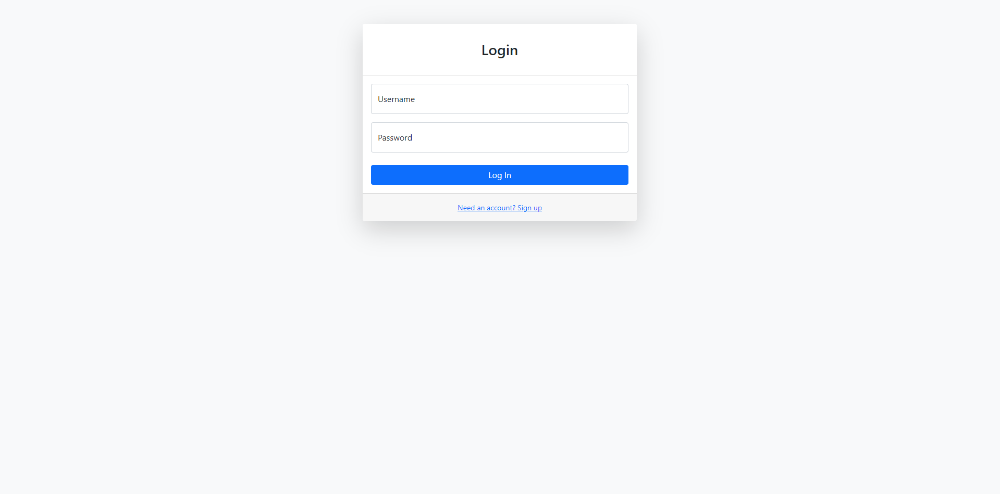
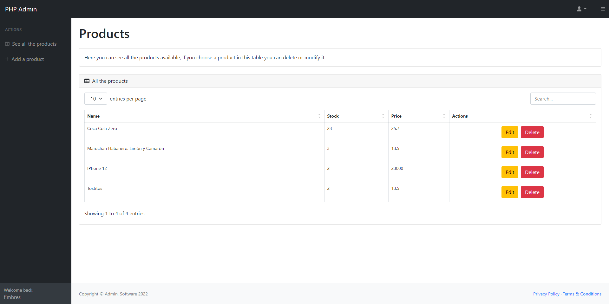

# PHP_Project

**Screenshots**

    
    

**All Features**

- Add Products
- Edit Products
- Delete Products
- Sign In
- Sign out
- Create Users

**Prerequisites**

- Be sure that you have already installed a PHP environment as XAMPP.

**Instructions**

- git clone `https://github.com/fimbres/PHP_Project.git`
- Open the project with IDE.
